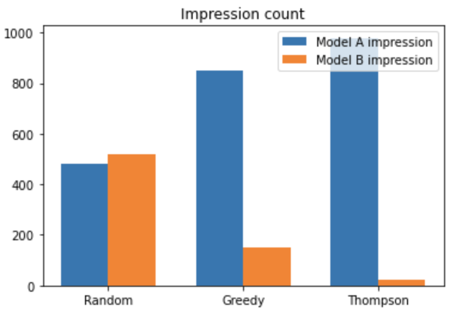
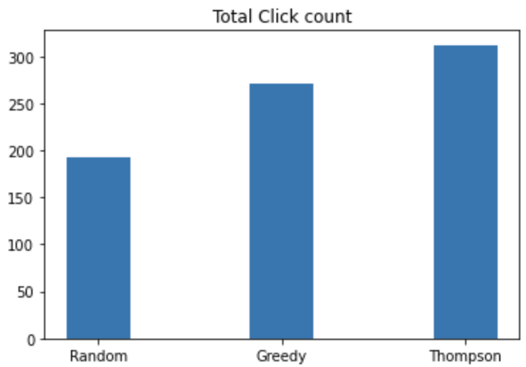

# thompson_sampling

### Thompson sampling example 

- How to implement A/B test in the AD system 

- Target : Maximize the CTR 

ex) Model A ctr : 0.3% , Model B ctr : 0.1% 

- 1) Random selection 
- 2) Epsilon Greedy Selection
- 3) Thompson Sampling 

#### Test setup 
- N : 1000 iteration 
- Set Actual CTR for A - 0.3%, B - 0.1%

#### Test result from the 3-method 

#### Analysis 
- Thompson sampling show the better performance with low regret 